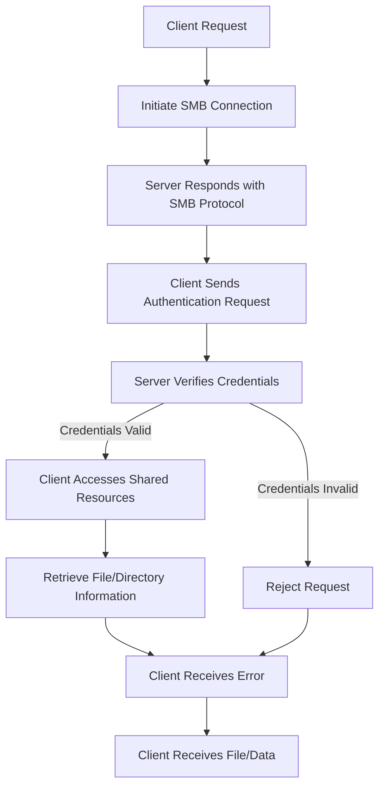

# Samba File Server Setup on Red Hat Enterprise Linux (RHEL)

## Objective

The objective of this project is to set up a Samba file server on Red Hat Enterprise Linux (RHEL) to 
provide file sharing services with Windows clients. This setup will enable file sharing and access control 
across different operating systems.

## Project Overview

1.  **Planning and Preparation**
    
    -   Define requirements and objectives.
    -   Prepare the RHEL environment.
    -   Install and configure Samba.
2.  **Samba Installation and Configuration**
    
    -   Install Samba and necessary utilities.
    -   Configure Samba shares and access control.
3.  **User and Permissions Management**
    
    -   Create and manage Samba users.
    -   Set up file and directory permissions.
4.  **Testing and Validation**
    
    -   Test Samba file sharing from Windows clients.
    -   Verify access control and permissions.
5.  **Documentation and Conclusion**
    
    -   Document the setup process.
    -   Evaluate benefits, challenges, and performance.

## Step-by-Step Configuration

### 1. Planning and Preparation

-   **Install RHEL**: Ensure RHEL is installed and updated on the server node.
-   **Update System**:
   
    `sudo yum update -y` 
    

### 2. Samba Installation and Configuration

#### On Samba Server Node (e.g., `samba-server`)

-   **Install Samba Package**:

    `sudo yum install samba samba-client samba-common -y` 
    
-   **Start and Enable Samba Services**:

    `sudo systemctl start smb
    sudo systemctl enable smb
    sudo systemctl start nmb
    sudo systemctl enable nmb` 
    
-   **Configure Samba Shares**:
    -   Edit `/etc/samba/smb.conf` and add the following configuration:

        
        `[share]
        path = /srv/samba/share
        valid users = @sambausers
        read only = no
        browsable = yes
        writable = yes` 
        
-   **Create Shared Directory**:

    `sudo mkdir -p /srv/samba/share
    sudo chown root:sambausers /srv/samba/share
    sudo chmod 2770 /srv/samba/share` 
    

### 3. User and Permissions Management

#### Create Samba Users

-   **Add System Users**:
  
    `sudo useradd sambauser
    sudo passwd sambauser` 
    
-   **Add Samba Users**:

    `sudo smbpasswd -a sambauser` 
    
-   **Create Samba Users Group**:

    `sudo groupadd sambausers
    sudo usermod -aG sambausers sambauser` 
    

### 4. Testing and Validation

-   **Test Samba File Sharing from Windows Clients**:
    -   On a Windows client, open File Explorer and connect to the Samba server using:

        `\\<samba_server_ip>\share` 
        
    -   Enter Samba user credentials when prompted.
-   **Verify Access Control and Permissions**:
    -   Create and modify files in the shared directory from the Windows client to ensure proper access 
control.

### 5. Documentation and Conclusion

-   **Document Configuration**: Record all installation and configuration steps, including Samba share 
settings and user management.
-   **Evaluate Benefits**:
    -   **Cross-Platform File Sharing**: Allows file sharing between Linux and Windows systems.
    -   **Access Control**: Provides mechanisms to manage user access and permissions.
-   **Challenges**:
    -   **Security**: Ensure Samba is securely configured to prevent unauthorized access.
    -   **Compatibility**: Verify compatibility and functionality with different versions of Windows 
clients.
